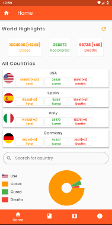
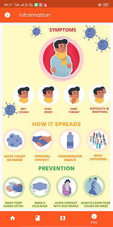

# Covid19 App2 for Topcoder's 3rd flutter challenge.

Was amongst 10 winners in this challenge. :)

### Functionality
- displays world data
- countrywise data
- pie chart for visualising data
- news reader for latest covid19 related updates
- map for showing affected areas, used previous app's code :P
  

### Youtube Link
https://www.youtube.com/watch?v=n9E-ctiaWHg

### Executable apk
It is provided in assets folder of repository

### Deployment
- install packages using
- ```flutter packages get```
- run on emulator or physical device

### Snapshots





